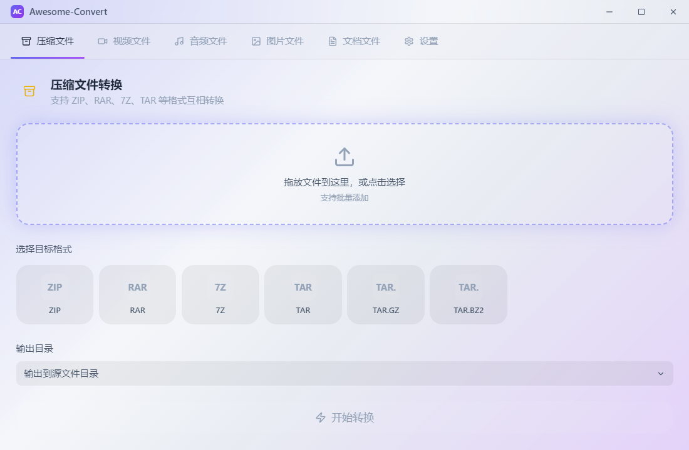

<div align="center">

# Awesome-Convert

**万能文件格式转换工具 · 纯本地运行！ · 无敌牛逼克拉斯体验GUI爆炸美丽**


[下载](https://github.com/JIAJIA-nya/Awesome-Convert/releases) · [功能特性](#功能特性) · [安装使用](#安装使用) · [构建指南](#构建指南)

</div>

---

## 预览

| 暗色模式 | 极光主题 |
|:---:|:---:|
|  |  |

| 日落主题 | 设置面板 |
|:---:|:---:|
|  |  |

| 主界面 |
|:---:|
|  |

---

## 功能特性

### 格式转换

| 类别 | 支持格式 |
|:---|:---|
| **压缩文件** | ZIP ↔ RAR ↔ 7Z ↔ TAR ↔ TAR.GZ |
| **视频** | MP4 ↔ MKV ↔ AVI ↔ MOV ↔ WMV ↔ FLV ↔ WebM |
| **音频** | MP3 ↔ WAV ↔ FLAC ↔ AAC ↔ OGG ↔ WMA ↔ M4A |
| **图片** | JPG ↔ PNG ↔ WebP ↔ BMP ↔ GIF ↔ TIFF ↔ ICO ↔ AVIF |
| **文档** | PDF ↔ DOCX ↔ TXT ↔ HTML ↔ Markdown ↔ CSV ↔ XLSX ↔ JSON |

- 单文件 / 批量转换
- 拖放添加 或 点击选择
- 实时进度百分比 + 详细日志
- 转换完成系统通知 + 打开文件夹快捷操作
- 错误原因展示 + 重试按钮

### 右键菜单集成

- Windows 资源管理器右键 → 「Awesome-Convert」级联菜单
- 根据文件后缀自动显示可转换的目标格式
- 点击即转换，无需打开主界面，只显示浮动进度
- 应用退出时自动移除菜单，不残留

### 外观系统

- **暗色 / 亮色模式** 一键切换
- **14 种预设主题色** + 自定义取色器
- **6 种背景渐变**：默认、海洋、日落、森林、极光、纯色
- **渐变强度滑块** (0-100%)
- **全局圆角** 实时调节 (0-30px)
- **6 种动画预设**：默认、淡入淡出、弹性滑动、缩放弹跳、弹跳、翻转
- **动画速度倍率** (0x-2x)
- **字体大小** (12-20px)
- 动画预设设置页内 **实时预览**
- **设置导入 / 导出** (JSON)

### 公告系统

- 每次启动自动获取 GitHub 公告仓库最新公告
- Markdown 渲染，亮色暗色均可读
- 设置面板支持自定义公告地址 + 手动检查

### 软件更新

- 检查 GitHub Releases 最新版本
- 有更新 / 已是最新 / 网络失败 三种状态
- 自动后台检查 (每次启动 / 每天 / 每周)

### 其他

- **开机自启** — 后台静默运行，托盘图标
- **命令行模式** — `app.exe --cli --input file.mp4 --to mkv`，无窗口转换
- **转换偏好** — 视频码率 / 分辨率 / 压缩级别 / 输出目录规则
- 自定义无边框窗口 + 标题栏阴影
- 纯本地运行，无需联网（公告和更新除外）
- 单个可执行文件，无需安装外部依赖

---

## 安装使用

### 下载安装包

前往 [Releases](https://github.com/JIAJIA-nya/Awesome-Convert/releases) 下载对应平台的安装包：

| 平台 | 文件 |
|:---|:---|
| Windows | `Awesome-Convert-Setup-x.x.x.exe` |
| macOS | `Awesome-Convert-x.x.x.dmg` |
| Linux | `Awesome-Convert-x.x.x.AppImage` |

### 开发模式运行

```bash
git clone https://github.com/JIAJIA-nya/Awesome-Convert.git
cd Awesome-Convert
npm install
npm run dev
```

---

## 构建指南

### 前置要求

- Node.js >= 18
- npm >= 9

### 构建当前平台

```bash
npm run build          # 编译主进程 + 渲染进程
npx electron-builder --win --x64     # Windows
npx electron-builder --mac --x64     # macOS (需 macOS 系统)
npx electron-builder --linux --x64   # Linux
```

产物输出在 `release/` 目录。

### GitHub Actions 自动构建

本项目包含 `.github/workflows/build.yml`，推送 tag 即可自动构建全平台并发布：

```bash
git tag v1.0.0
git push origin v1.0.0
```

GitHub Actions 会在 Windows / macOS / Linux 三个平台构建，自动创建 Release 并上传所有安装包。

---

## 命令行使用

```bash
# 转换单个文件（无窗口，浮动进度球）
Awesome-Convert.exe --cli --input "D:\video.mp4" --to mkv

# 转换图片
Awesome-Convert.exe --cli --input "photo.png" --to webp
```

---

## 技术栈

- **Electron** — 桌面应用框架
- **React 18** + **TypeScript** — UI 开发
- **Vite** — 构建工具
- **Tailwind CSS** — 样式系统
- **Framer Motion** — 动画引擎
- **Sharp** — 图片转换
- **FFmpeg** — 视频/音频转换
- **Archiver** / **extract-zip** — 压缩包处理
- **Mammoth** / **marked** / **XLSX** — 文档转换

---

## 许可证

[Apache License 2.0](LICENSE)
